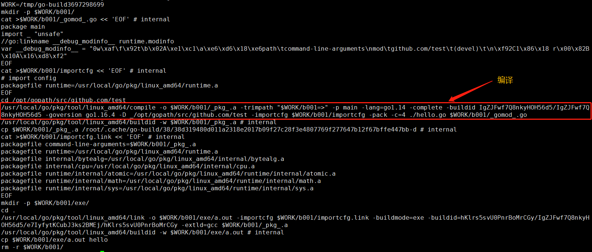
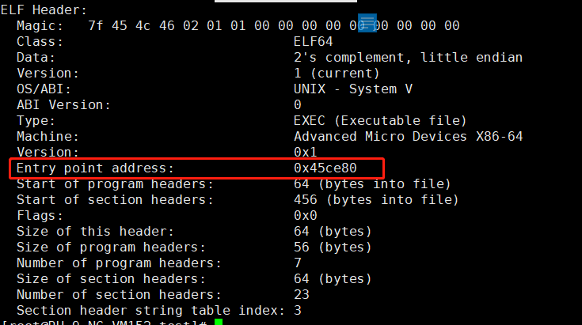
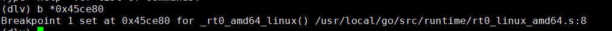

1. 理解可执行文件
```go
package main

func main() {
    println("hello world!")
}
```
* 编译
`go build -x hello.go`
---


* 不同操作系统上的规范不一样

|linux|windows|MacOS|
|:---|:---:|---:|
EFL|PE|Mach-O|
已linux的可执行文件ELF为例，ELF由几部分构成：

+ ELF header
+ Section header
+ Sections

解析ELF header-->加载文件内容值内存-->从entry point开始执行代码
+ 通过entry point找到go进程的入口，使用readelf
`readelf -h ./hello`
  ---

`dlv exec ./hello`
---

2. GMP调度
+ G：goroutine，一个计算任务，由需要执行的代码和其上下文组成，
  上下文包括：当前代码的位置、栈顶、栈底地址，状态等
+ M：machine，系统线程，执行实体，想要再CPU上执行代码，必须有线程，与C
语言中的线程相同，通过系统调用clone来创建
+ P：processor，虚拟处理器，M必须获得P才能执行代码，否则必须陷入休眠(后台监控线程除外)
- g0: 每个线程m都有自己的g0，runtime.g0是和runtime.m0绑定的g0，这个g0是runtime的一个全局
变量，整个系统只有一个；其它普通线程也有自己的g0，主要负责执行调度相关的代码
- 一般情况下，M约等于P的数量，当有M被CGO或syscall阻塞时，会创建额外的M去处理任务，M的数量默认限制10000，超过会进程崩溃，已创建的M时没有办法销毁的
- 调度过程：
    * 新生产的G进入M的runnext结构，runnext只存一个数据，如果已有数据则将原数据调度到local run queue数组的末尾
    * local run queue是一个大小为256的数组，当该数组已满且又有一个新的G从runnext调度过来时，取数组的后一半和新来的G
    一起组成batch结构数组，然后转换为链表，最后添加到global run queue的后面，完成调度
[演示动画](https://www.figma.com/proto/gByIPDf4nRr6No4dNYjn3e/bootstrap?page-id=242%3A7&node-id=242%3A9&viewport=516%2C209%2C0.07501539587974548&scaling=scale-down-width "M生产调度")
    * runtime执行G的过程：schedule-->execute-->gogo-->goexit-->schedule
    * schedtick: P的调度计数器，从global run queue中取G时需要加锁
    - 当schedtick%61==0时
      + 从global run queue的head取G执行
    - 当schedtick%61==0时
      + runnext有值时：
         - 从runnext取G执行
      + runnext没有值时：
         - local run queue有值时：
            * 取local run queue的第一个G执行
         - local run queue没有值时：
            * global run queue有值
              + 从global里取前total/gomaxpeocs+1个，但不能超过128个，并取第一个G执行，其余放入local run queue
            * global run queue没有值
              + M从别的P的local run queue头部开始取走一半G，取最后一个G执行，剩余的G放入自己的local run queue中
[演示动画](https://www.figma.com/proto/gByIPDf4nRr6No4dNYjn3e/bootstrap?page-id=143%3A212&node-id=143%3A213&viewport=134%2C83%2C0.06213996931910515&scaling=scale-down-width "M消费调度")
* 可以处理的阻塞：无缓存的chan、网络等待读写、time sleep，select全部阻塞、锁。
这些区块不会阻塞调度循环，而是把G挂起，其实是让G先进某个数据结构，等待ready后再继续执行，不会占用线程，线程回继续执行其它的G
* 不能处理的阻塞：CGO，syscall。执行时必须占用一个线程，sysmon(system monitor)来处理此类阻塞。
  - 如果syscall卡了很久(10ms)，就把P剥离(handoffp)
  - 如果时用户G运行很久(10ms)了，那么发信号SIGURG抢占
* M从一个G切换到另一个G，只要把gobuf结构的几个现场字段保留下来，再把G网队列里一仍，M就可以执行其它的G了，无需进入内核态，切换成本非常低

3. runtime
- runtime.runqput：将G放入队列的逻辑
- runtime.runqget: 从队列中取出G的逻辑,runnxt和local run queue
- runtime.globrunqput: 将G放入全局队列(global run queue)，加锁
- runtime.globrunqget：尝试从全局队列获取一批G
- runtime.schedule：找到可以运行的G，并执行它
- runtime.findrunnable：尝试从其它P中窃取G
- runtime.sysmon：system monitor用来处理CGO或syscall造成的阻塞或G运行时间过长
- runtime._rt0_amd64_linux：程序入口
