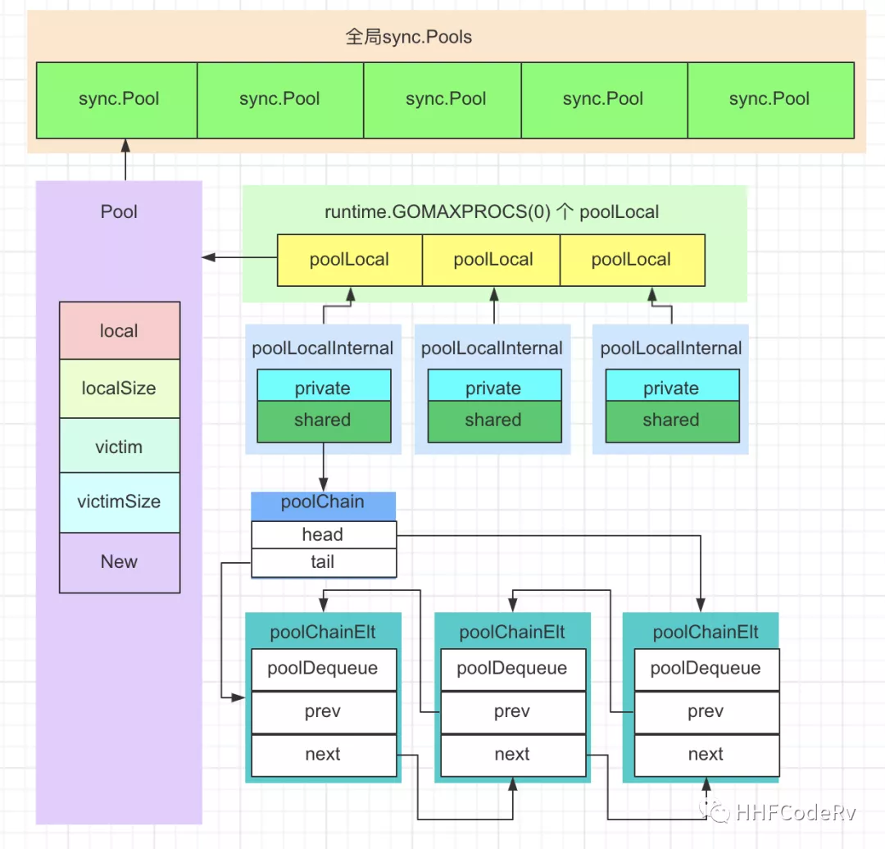
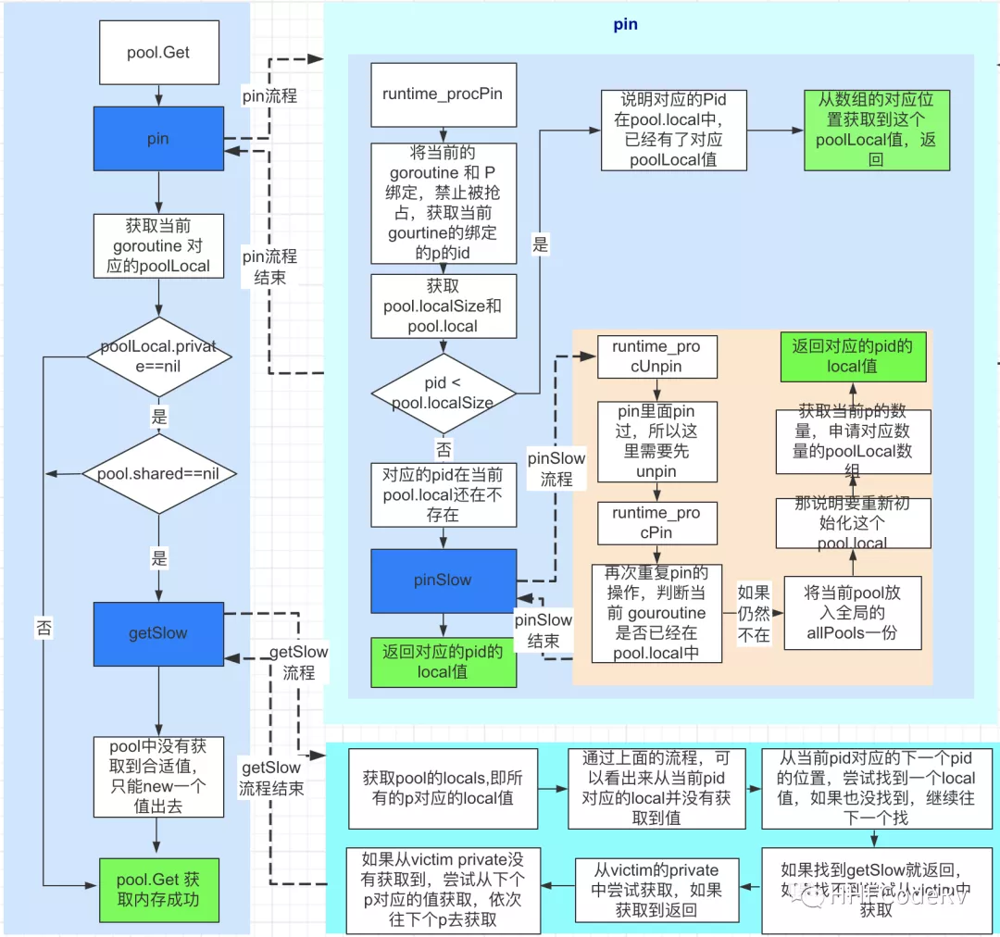
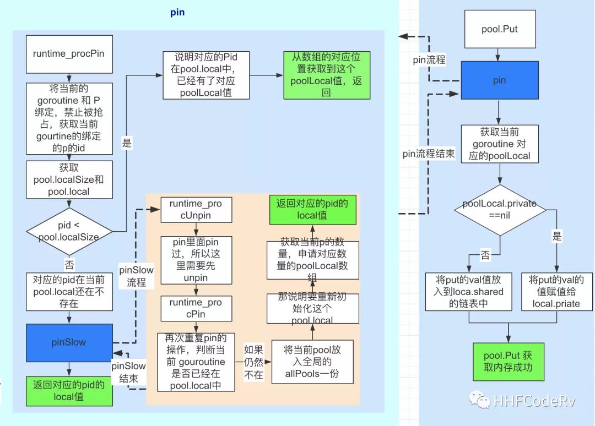
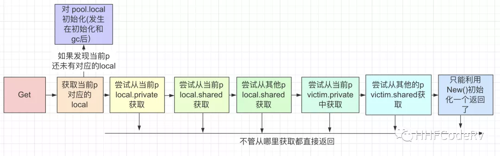
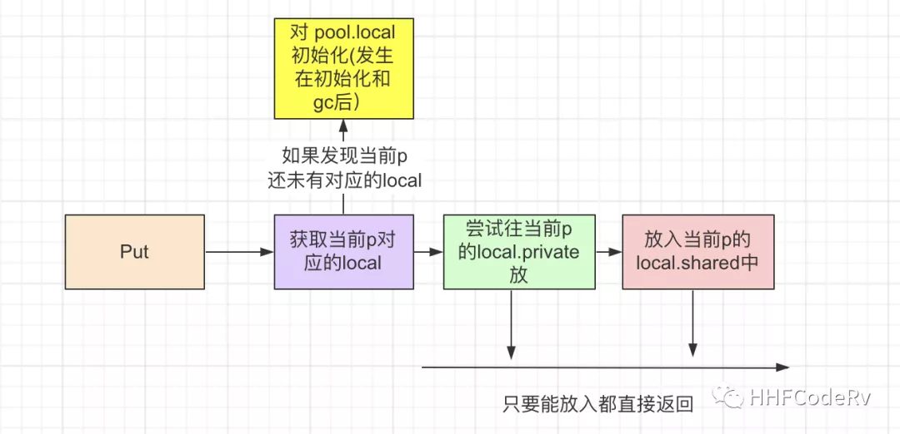
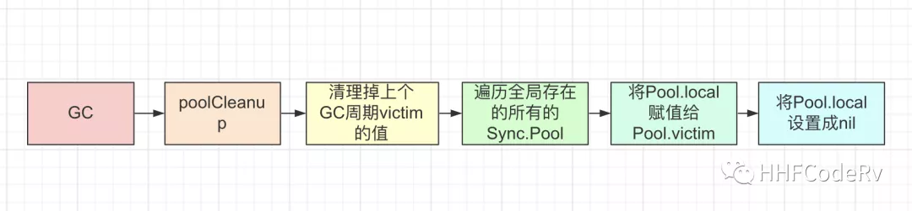

### 使用方法

`sysc.Pool`是一个内存池。带GC功能的语言都存在STW问题，需要回收的内存块越多，STW持续时间就越长如果能让new出来的变量，一直不被回收，得到重复利用，就减轻了GC的压力。

示例如下：

```go
func (engine *Engine) ServeHTTP(w http.ResponseWriter, req *http.Request) {
    c:= engine.pool.Get().(*Context)
    c.writemem.reset(w)
    c.Request = req
    c.reset()
    
    engine.handleHTTPRequest(c)
    
    engine.pool.Put(c)
}
```

先Get获取内存空间，基于这个内存做相关的处理，然后再将这个内存还回(Put)到sync.Pool。

### Pool结构



### 源码图解











