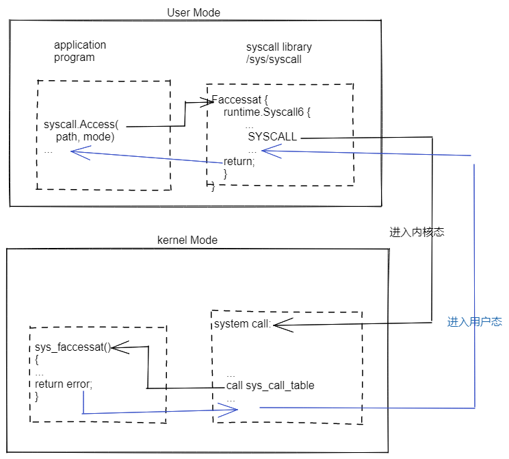

##### 什么是系统调用

系统调用是操作系统内核为应用提供的API，是内核为应用提供的服务，操作系统为上层的应用程序提供了一个“标准库”。对于应用来说，系统调用可以实现超出自己能力以外的事情。

系统调用有自己的一套调用规约，需要使用寄存器，和C语言的调用规约相似。

##### syscall之后发生了什么



##### 入口

```go
func Syscall(trap, a1, a2, a3 uintptr) (r1, r2 uintptr, err syscall.Errno)
func Syscall6(trap, a1, a2, a3, a4, a5, a6 uintptr) (r1, r2 uintptr, err syscall.Errno)
// RawSyscall只是为了执行那些一定不会阻塞的系统调用时，能节省两次对runtime的函数调用的消耗
func RawSyscall(trap, a1, a2, a3 uintptr) (r1, r2 uintptr, err syscall.Errno)
func RawSyscall6(trap, a1, a2, a3, a4, a5, a6 uintptr) (r1, r2 uintptr, err syscall.Errno)
```

由于RawSyscall相较与Syscall缺少了runtime.entersyscall(SB)以及runtime.exitssyscall(SB)的调用，当g执行阻塞性质的系统调用时，当前g会维持running状态，runtime系统监控在进行全局调度的时候一旦发现运行超过10ms的g就会执行抢占操作，通过发送信号量给g对应的线程，而由于线程在初始化的时候进行了信号量的监听以及设置了响应的sa_flags参数，虽然包含诸如SA_RESTART参数会让系统调用在信号中断后自动恢复，但是不是所有系统调用都会有效，这将会导致在收到信号量的时候对正在阻塞的系统调用产生中断，这种行为往往会给使用者带来意料之外的情况

